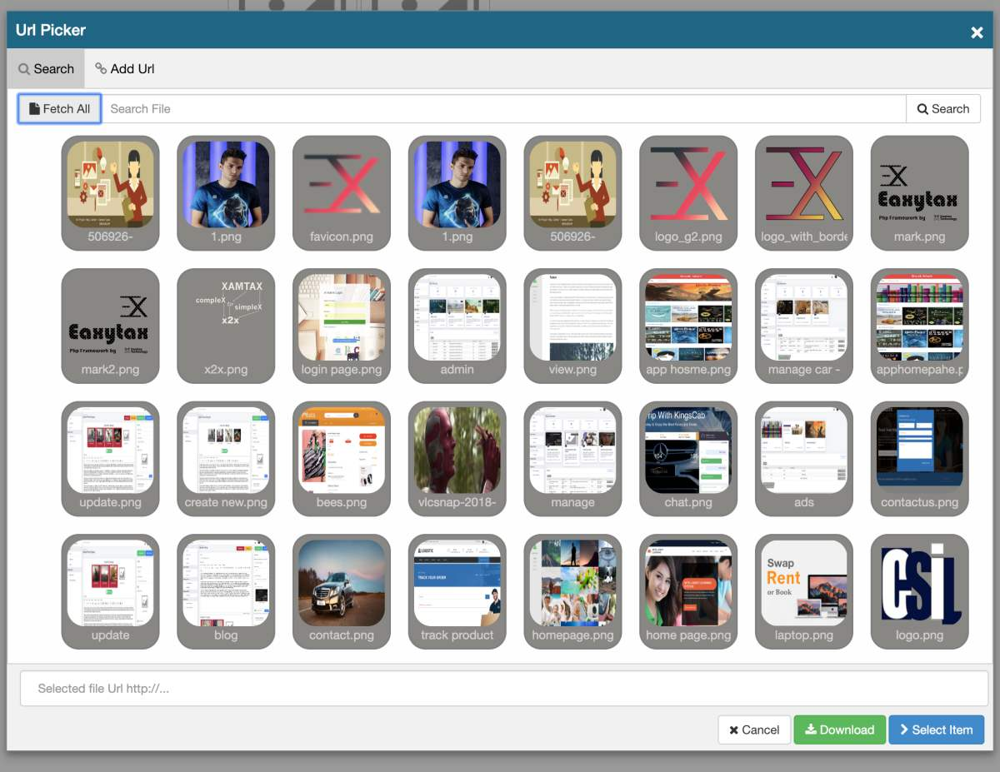
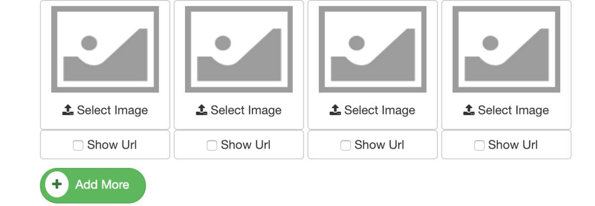

# EasyTax exUrlPicker (v1.0)
> Use this plugin to locate file in Model1FileLocator or provide your own 
controller that return list of url for ```q=``` Get Request passed in.

This is a sub-module under [exUrlPicker](https://github.com/easytax/ex_filepicker), this module just focus more on search request and enable you to download url.



## Requirement
> Nothing, Just  enable ```Model1FileLocator```


## Features
- [x] Add Url (like bookmark)
- [x] Picker for Url
- [x] Search Url and Use
- [x] Download Url File

## Quick Use 
> Clone Plugin Repository and Add it to Plugins Folder of your project or shared plugins folder.
> This will allows you to use the plugin in your  Project.

```php
    
        {!! HtmlForm1::addInput('Selected Path', ['name'=>'file2']) !!}
        <button id="btn_url_picker2" class="btn btn-primary">Pick Image</button>
        <br/><br/><br/>


        <?php
            //init file picker
            $picker = new exUrlPicker(-1, null);

            // assign id for button and text field
            $picker->add('btn_file_picker2', 'file2');


            // use filePicker Widget
            $picker->addField('image_file3');
            $picker->addField('image_file4');

            // add more button
            $picker->addMoreButton('file_list[]');
        ?>

```


### Chain link
> Can also be linked together for easy use
```php
    echo (new exUrlPicker(User::withId(1), false))->addField('image_file1')->addField('image_file2');
```


### Add More Button
> for more,  add ```addMoreButton()``` method to allow user to add more file, 
```php
    //init file picker
    $picker = new exUrlPicker();
    
    // add more button
    $picker->addMoreButton('file_list[]');
```



## Param
```php 
    // Parameter
    new exUrlPicker($search_limit = -1,  $urlController = null, $model = null)
    
    
    // controller that return url array list
    // default is null but is using  "exUrlPickerController::search()"
    'urlController'=>null,
    
    // limit of url to return per search. Default -1 means all
    'search_limit'=>-1,
    
    // search in model only [default is Model1FileLocator]
    // please add model to use if your Model1FileLocator contain sensitive link... maybe link for paid material
    'model'=>false,
    
    // the search query. This will be appended automatically for each request
    //'q'=>auto,

```


## Create Custom Url Controller
```php 
   
 
    class MyCustomUrlController extends Controller1{
    
    
        /**
         * @return bool|string
         */
        static function search(){
            // model information. use to fetch data in mode
            $model_id = isset_or($_REQUEST['model_id'], null);
            $model_name = isset_or($_REQUEST['model_name'], null);
    
            /** @var Model1 $model */
            $model = $model_id? $model_name::withId($model_id): null;
            $search_limit = $_REQUEST['search_limit'];
    
            // search query
            $q = $_REQUEST['q'];
    
            // Fetch Images
            $allImages = $model? Model1FileLocator::find_likely($q, $search_limit, true, $model): Model1FileLocator::find_likely($q, $search_limit, true);
            return ResultObject1::make(!!$allImages,  null, $allImages);
        }

   
   ...
   
   
  
   
```

### Use Custom Url Controller
```php
    // init with MyCustomUrlController
    $urlPicker = new exUrlPicker(-1, "MyCustomUrlController::search()");
    
    // add more button
    $picker->addMoreButton('file_list[]');
```
    


## Author
:kissing: from the creator of Easytax. Samson Iyanu (@samtax01)